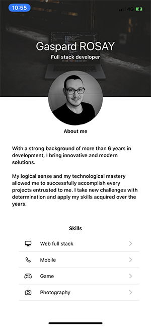
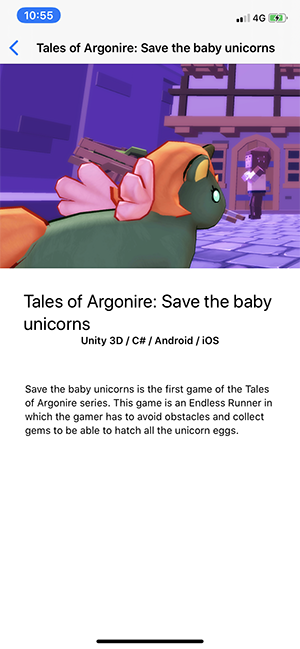
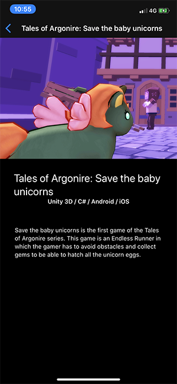

# Rosay-Portfolio-SWIFT

## What is it?

This application is nothing else than my portfolio, developed in Swift and using SwiftUI.

Localization is enabled and compatible with French and English. Language can be set in phone's settings for the application.

The app is compatible with all iPhones running iOS 13+.

## How to install 

As the app isn't intended for large audiences, it can't be uploaded on the AppStore.

However, you can clone this repo and compile the app via Xcode 11+ in order to install it on your iPhone.

**Some texts may be truncated when using the simulator, it's a known bug with a SwiftUI parameter.**

### Requirements

* iOS 13+ iPhone 
* Xcode 11+
* macOS Catalina+ (only if you want to use SwiftUI canvas)

## For who ?

The app aims mainly recruiters who could be interested in my profile.

## License

This app is under Apache-2.0 License.

## ToDo:

* Connect to a small API to get data instead of hard-coded texts.

## Screenshots

### Light theme

### Dark theme

